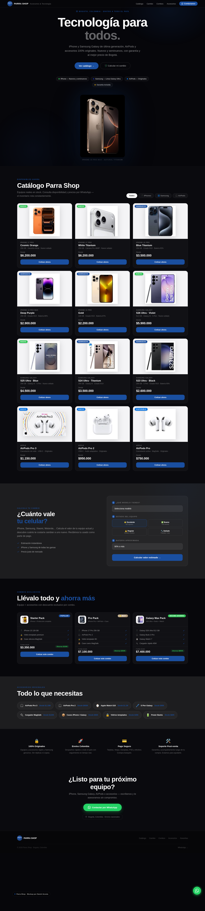

# Parra Shop — Website Mockup

Mockup de una sola página (single-file) para **Parra Shop**, tienda de tecnología
en Bogotá: iPhone, Samsung Galaxy, AirPods y accesorios originales. Pensado como
demo visual para presentación/negociación con el cliente.



## Qué incluye

- **Tema oscuro premium** con acento azul de marca, en español.
- **Catálogo con fotos reales** de los productos (no ilustraciones): 12 equipos
  filtrables por pestaña — iPhones, Samsung y AirPods.
- **Calculadora de cambio** ("¿cuánto vale tu celular?") para recibir usados como
  parte de pago — iPhone, Samsung, Xiaomi y otros.
- **Combos / bundles** con ahorro destacado.
- **Sección de accesorios**, señales de confianza, CTA y footer.
- **CTAs a WhatsApp** en todo el sitio (`wa.me/573022522545`).
- **Panel "Personalizar"** (botón 🎨 abajo a la izquierda): cambia el color de
  marca y muestra/oculta secciones en vivo — útil durante la presentación.

## Estructura

```
index.html              · La página completa (HTML + CSS + JS en un solo archivo)
tweaks-panel.jsx        · Componentes React del panel de personalización en vivo
assets/products/        · Fotos reales de los productos (18 imágenes)
assets/previews/        · Capturas de referencia (desktop + móvil)
```

## Cómo verlo

Ábrelo con un servidor local (recomendado, para que carguen el panel y las fuentes):

```bash
python3 -m http.server 8000
# luego abre http://localhost:8000/index.html
```

También funciona abriendo `index.html` directamente; en ese caso el panel
"Personalizar" puede no cargar (los navegadores bloquean módulos vía `file://`),
pero el sitio se ve completo.

## Notas para revisión

- **Precios**: son valores de referencia/placeholder en COP — ajustar a los
  precios reales del cliente.
- **Modelos en catálogo**: tomados de las fotos entregadas (iPhone 13 Pro → 17 Pro,
  Samsung Galaxy S22 → S26 Ultra, AirPods Pro/2/3).
- **Número de WhatsApp, ciudad y datos de contacto**: usar los del template
  (`573022522545`, Bogotá) — confirmar/actualizar con el cliente.
- Requiere internet para la tipografía (Google Fonts) y React (CDN); sin internet
  cae a una fuente del sistema y el panel de personalización se desactiva, sin
  afectar el resto del sitio.
