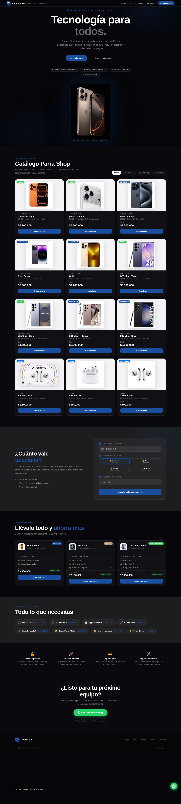

# Parra Shop — Website Mockup

Mockup de una sola página (single-file) para **Parra Shop**, tienda de tecnología
en Bogotá: iPhone, Samsung Galaxy, AirPods y accesorios originales. Pensado como
demo visual para presentación/negociación con el cliente.



## Qué incluye

- **Tema oscuro premium** con acento azul de marca, en español.
- **Catálogo con fotos reales** de los productos (no ilustraciones): 12 equipos
  filtrables por pestaña — iPhones, Samsung y AirPods.
- **Calculadora de cambio** ("¿cuánto vale tu celular?") para recibir usados como
  parte de pago — iPhone, Samsung, Xiaomi y otros.
- **Combos / bundles** con ahorro destacado.
- **Sección de accesorios**, señales de confianza, CTA y footer.
- **CTAs a WhatsApp** en todo el sitio (`wa.me/573022522545`).
- **Panel "Personalizar"** (botón 🎨 abajo a la izquierda): cambia el color de
  marca y muestra/oculta secciones en vivo — útil durante la presentación.

## Estructura

```
index.html              · La página completa (HTML + CSS + JS en un solo archivo)
tweaks-panel.jsx        · Componentes React del panel de personalización en vivo
assets/products/        · Fotos reales de los productos (18 imágenes)
assets/previews/        · Capturas de referencia (desktop + móvil)
```

## Cómo verlo

Ábrelo con un servidor local (recomendado, para que carguen el panel y las fuentes):

```bash
python3 -m http.server 8000
# luego abre http://localhost:8000/index.html
```

También funciona abriendo `index.html` directamente; en ese caso el panel
"Personalizar" puede no cargar (los navegadores bloquean módulos vía `file://`),
pero el sitio se ve completo.

## Panel de administración (serverless)

`admin.html` es un panel de gestión de productos **sin backend**: usa la GitHub
Contents API de este mismo repositorio como base de datos. Cada publicación es un
commit directo a `main`, y GitHub Pages reconstruye el sitio (~20–90s después).

### Cómo usarlo

1. Abre `admin.html` (idealmente vía servidor local o ya publicado en Pages).
2. Ingresa un **GitHub Personal Access Token** con permiso `Contents: Read and
   write` sobre `Daniel666674/IMPORTECH`. El token vive **solo en `sessionStorage`**
   del navegador — nunca se guarda en un archivo ni se sube al repo.
3. Agrega/edita productos. Los cambios se marcan como "sin publicar" (badge ámbar)
   y **no tocan el repo** hasta pulsar **Publicar**.
4. Al publicar, en este orden: (1) fotos nuevas → (2) página HTML de cada producto
   → (3) `products-data.js` (registro de verdad) → (4) `sitemap.xml`. Cada escritura
   relee el `sha` fresco y reintenta ante conflicto 409.

### Modelo de datos

- `assets/js/products-data.js` (`window.PRODUCTS`) es el registro de verdad; lo lee
  `catalogo.html` con cache-busting para reflejar publicaciones al instante.
- Cada producto genera una página real en `producto/{slug}.html` (título/meta/OG
  propios + selector de variantes que funciona).
- **Variantes en dos dimensiones independientes** — almacenamiento y color — ambas
  pueden estar pobladas a la vez. Si es así, el cliente elige las dos y el stock
  disponible = el **mínimo** entre ellas.
- Cada fila de variante tiene su propio **precio/costo opcional** (override); si se
  deja en blanco, cae al valor base del producto. La misma función de precio se usa
  en tienda, panel y venta interna (`assets/js/store-core.js`).
- `cost` es **interno**: se elimina de cada página pública generada. ⚠️ Como el repo
  es público, `products-data.js` es técnicamente visible por URL — si el costo debe
  ser realmente privado, mover el repo a privado (Pages sigue funcionando en planes
  pagos).

### Archivos del panel

```
admin.html                 · Panel CRUD + auth PAT + publicación en dos fases
assets/js/store-core.js    · Lógica compartida: precio, disponibilidad, formato COP
assets/js/products-data.js · Registro de verdad (window.PRODUCTS) — autogenerado
producto/_template.html    · Plantilla que genPage() rellena por producto
catalogo.html              · Tienda pública que lee products-data.js
```

## Notas para revisión

- **Precios**: son valores de referencia/placeholder en COP — ajustar a los
  precios reales del cliente.
- **Modelos en catálogo**: tomados de las fotos entregadas (iPhone 13 Pro → 17 Pro,
  Samsung Galaxy S22 → S26 Ultra, AirPods Pro/2/3).
- **Número de WhatsApp, ciudad y datos de contacto**: usar los del template
  (`573022522545`, Bogotá) — confirmar/actualizar con el cliente.
- Requiere internet para la tipografía (Google Fonts) y React (CDN); sin internet
  cae a una fuente del sistema y el panel de personalización se desactiva, sin
  afectar el resto del sitio.
